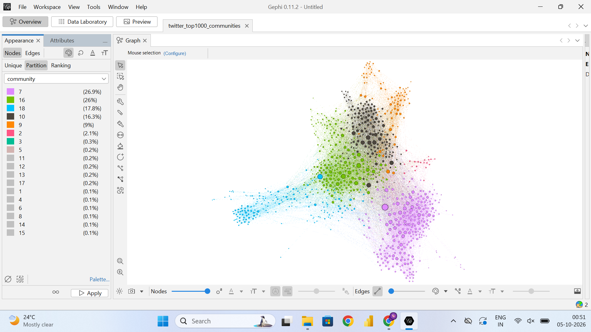
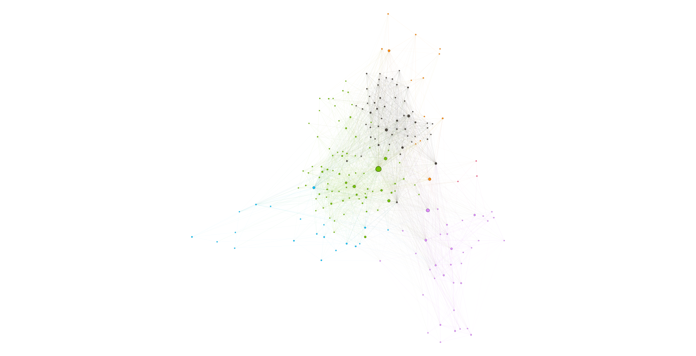
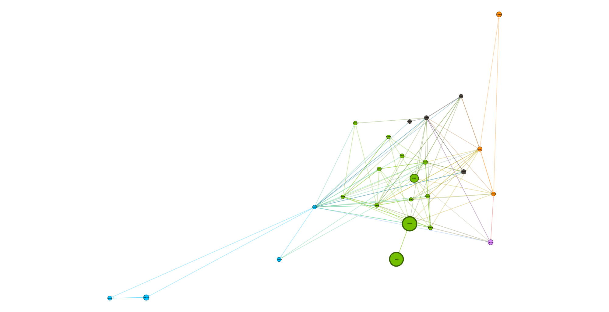
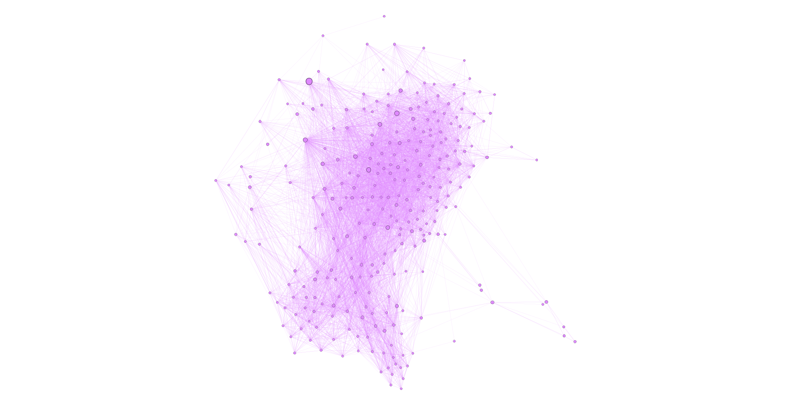
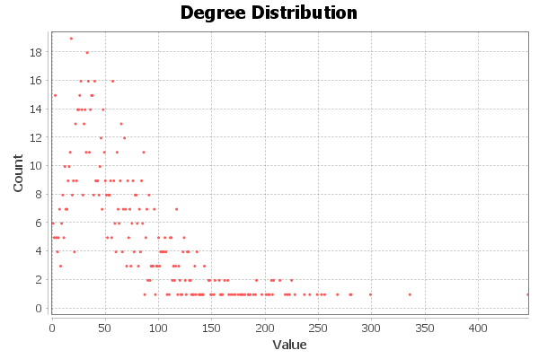
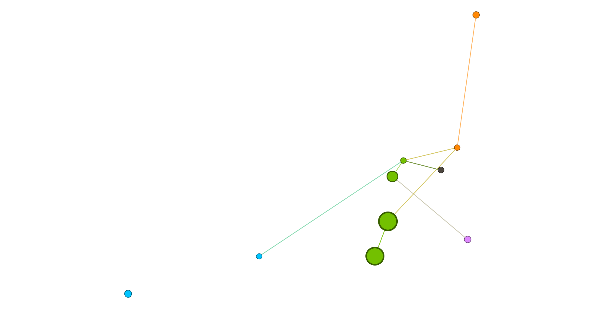
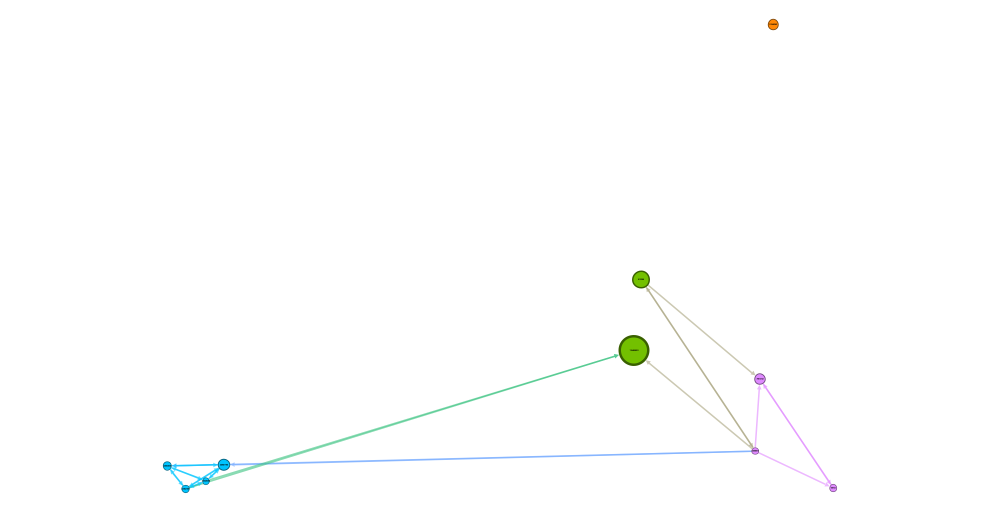
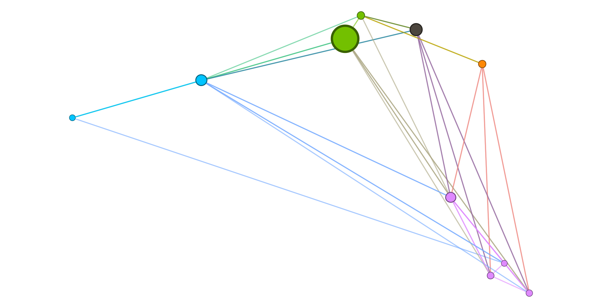

# Social Media Network Analytics

An end-to-end analysis of a Twitter social network with 81,306 users and 1.77 million connections. The project finds the most influential users, the users who act as bridges between groups, and the communities the network is organised into, using Python, NetworkX, and Gephi.

## Objectives

- Collect and clean a raw Twitter connections dataset into an analysis-ready format
- Build a directed social graph and validate its structure
- Measure influence and connectivity using degree, PageRank, betweenness, and closeness centrality
- Detect communities of closely connected users with the Louvain algorithm
- Visualize the network with NetworkX and Gephi
- Summarize the key structural insights about the network

## What it does

The full workflow is in one notebook, `notebooks/sm_network_analysis.ipynb`:

1. **Data loading and checks**: reads the raw edge list and checks size, data types, missing values, duplicates, and self-loops
2. **Cleaning**: removes duplicate connections and self-loops, then saves the cleaned edge list
3. **Network construction**: builds a directed graph in NetworkX
4. **Network-level analysis**: density, average degree, connected components, clustering coefficient, and transitivity
5. **Centrality analysis**: in-degree, out-degree, PageRank, approximate betweenness, and approximate closeness
6. **Community detection**: Louvain algorithm on the full network and on a smaller network of the top 1,000 users
7. **Visualization**: charts in Matplotlib, a NetworkX drawing of the top 20 users, and an export to Gephi for interactive exploration

## Dataset

The data is the Twitter ego-network dataset (`twitter_combined.txt`) from the Stanford Network Analysis Project (SNAP). Each row is one directed connection between two user IDs.

- Source: https://snap.stanford.edu/data/ego-Twitter.html
- Citation: J. McAuley and J. Leskovec, "Learning to Discover Social Circles in Ego Networks", NIPS 2012

| Cleaning step | Result |
|---|---|
| Raw rows loaded | 2,420,766 |
| Missing values | 0 |
| Duplicate rows removed | 652,617 |
| Rows after removing duplicates | 1,768,149 |
| Self-loops removed | 14 |
| Final connections | 1,768,135 |
| Unique users | 81,306 |

The raw file contains 22 self-loop rows; 14 remain once duplicates are removed. The cleaned edge list is saved as `twitter_network_clean.csv`, and the graph built from it has the same number of edges as the cleaned file has rows.

## Results

### Network summary

| Measure | Value |
|---|---|
| Users (nodes) | 81,306 |
| Directed connections (edges) | 1,768,135 |
| Connections when direction is ignored | 1,342,296 |
| Network density | 0.000267 |
| Average in-degree / out-degree | 21.75 |
| Connected components (undirected) | 1 |
| Average clustering coefficient | 0.565 |
| Transitivity | 0.171 |
| Communities (Louvain, full network) | 73 |

The network is very sparse: only about 0.03% of all possible connections exist. Even so, every user can reach every other user when direction is ignored. The average clustering coefficient (0.565) is much higher than the transitivity (0.171), which means individual users' neighbourhoods are tightly knit, but this does not hold evenly across the whole network. That mix of dense local groups and long bridging paths is typical of real social networks.

The degree distribution chart in the notebook shows that most users have few connections, while a small number have thousands.

### Most influential users (PageRank)

| Rank | User ID | PageRank | In-degree | Out-degree |
|---|---|---|---|---|
| 1 | 115485051 | 0.004331 | 3,383 | 1 |
| 2 | 116485573 | 0.004133 | 4 | 1 |
| 3 | 813286 | 0.002339 | 2,647 | 1,111 |
| 4 | 40981798 | 0.001372 | 3,216 | 119 |
| 5 | 7861312 | 0.001254 | 2,074 | 224 |
| 6 | 11348282 | 0.001222 | 1,707 | 172 |
| 7 | 17093617 | 0.001076 | 1,186 | 687 |
| 8 | 15439395 | 0.001031 | 1,108 | 334 |
| 9 | 18396070 | 0.001029 | 265 | 45 |
| 10 | 14230524 | 0.001014 | 1,214 | 62 |

User 116485573 ranks second with only 4 incoming connections. PageRank rewards being linked to by important users, not just by many users, so a single link from a very high-ranking account can outweigh thousands of ordinary ones.

### Most connected users (degree)

| Rank | Most incoming connections | In-degree | Most outgoing connections | Out-degree |
|---|---|---|---|---|
| 1 | 115485051 | 3,383 | 59804598 | 1,205 |
| 2 | 40981798 | 3,216 | 3359851 | 1,158 |
| 3 | 43003845 | 2,735 | 813286 | 1,111 |
| 4 | 813286 | 2,647 | 5442012 | 1,069 |
| 5 | 22462180 | 2,471 | 18581803 | 930 |

### Bridge users (approximate betweenness)

Betweenness identifies users who sit on many of the shortest paths between other users.

| Rank | User ID | Betweenness | PageRank |
|---|---|---|---|
| 1 | 813286 | 0.1653 | 0.002339 |
| 2 | 17093617 | 0.0637 | 0.001076 |
| 3 | 15846407 | 0.0542 | 0.000813 |
| 4 | 3359851 | 0.0481 | 0.000652 |
| 5 | 15439395 | 0.0306 | 0.001031 |
| 6 | 12611642 | 0.0306 | 0.000330 |
| 7 | 59804598 | 0.0262 | 0.000334 |
| 8 | 5442012 | 0.0228 | 0.000273 |
| 9 | 22679419 | 0.0207 | 0.000295 |
| 10 | 2367911 | 0.0199 | 0.000259 |

User 813286 stands out: its betweenness is more than twice that of the next user. It also ranks third by PageRank, fourth by in-degree, and third by out-degree, so it is both a popular account and the main bridge between different parts of the network.

### Closeness centrality (approximate)

Closeness was calculated for a random sample of 1,000 users. The highest-scoring users in that sample are 73707412 (0.338), 16726878 (0.337), and 49717874 (0.335). None of them appears among the top PageRank or betweenness users, so closeness picks out a different group again.

### Key users at a glance

| Role | User ID |
|---|---|
| Highest PageRank | 115485051 |
| Highest in-degree (3,383) | 115485051 |
| Highest out-degree (1,205) | 59804598 |
| Highest betweenness | 813286 |

Different measures pick out different users, which is the main finding: "important" depends on whether you mean widely followed, highly active, or structurally central.

### Communities

The Louvain algorithm found 73 communities in the full network.

| Rank | Community ID | Users | Most influential member (by PageRank) |
|---|---|---|---|
| 1 | 6 | 9,904 | 115485051 |
| 2 | 11 | 8,464 | 15913 |
| 3 | 8 | 6,394 | 972651 |
| 4 | 0 | 6,222 | 40981798 |
| 5 | 52 | 4,852 | 63485337 |
| 6 | 62 | 4,108 | 15853668 |
| 7 | 23 | 3,530 | 11348282 |
| 8 | 33 | 2,561 | 17093617 |
| 9 | 7 | 2,405 | 36735522 |
| 10 | 5 | 1,952 | 807095 |

The four largest communities hold 30,984 users, about 38% of the network. A few large communities sit alongside a long tail of small ones.

For visualization, a smaller network of the top 1,000 users by PageRank (30,628 directed connections) was analysed again with Louvain, giving 18 communities. Five of them hold 960 of the 1,000 users (269, 260, 178, 163, and 90), while several of the rest have only one or two users.

### Charts

The charts are produced by the notebook and can be viewed there: the degree distribution, the top 10 users by PageRank, the top 10 users by betweenness, the community sizes, and a NetworkX drawing of the 20 highest-ranked users with the 71 connections among them.

### Network visualizations (Gephi)

These images use the network of the top 1,000 users by PageRank. Colour shows the community each user belongs to.

**Communities and influence**


The full top-1,000 network, laid out with ForceAtlas 2. Node size shows PageRank, so the largest circles are the most influential users. The communities separate into clearly distinct regions.



The colour key for the image above, listing each community with its share of the 1,000 users. A share of 26.9% is 269 users.

**Bridging**


The same network with node size showing betweenness centrality. One user (813286) dominates, sitting between several communities, which is why it acts as the main bridge in the network. Compared with the previous image, this shows that the most influential users and the main bridge users are not the same accounts.

**The top bridge user**



User 813286 and the users directly connected to it.

**Top 20 users**



The highest-ranked users by PageRank and the connections between them, labelled with their user IDs. Node size shows PageRank.

**Inside one community**



One of the largest communities in the top-1,000 network. The nodes are similar in size, so this community is densely connected without a single dominant user; the network's most influential accounts sit in other communities.

**Degree**


The same network with node size showing degree, the number of connections each user has within the top-1,000 network.



The degree distribution of the top-1,000 network, from Gephi's Average Degree report. It covers these 1,000 users only, so it differs from the notebook's chart for all 81,306 users.

**Top 10 users by PageRank**



The ten users in `outputs/top_pagerank_users.csv` and the connections among them. Node size shows PageRank.

**Top 10 users by in-degree**



The ten users in `outputs/top_degree_users.csv` and the connections among them.

**Top 10 users by betweenness**



The ten users in `outputs/top_betweenness_users.csv` and the connections among them. Node size shows betweenness.

In these three images, only the connections among the ten users are drawn; their connections to the rest of the network are left out.

## Key findings

- **User 115485051 is the most influential and most widely followed account.** It has both the highest PageRank and the highest in-degree.
- **User 59804598 is the most active.** It has the highest out-degree, with 1,205 outgoing connections.
- **User 813286 is the network's main bridge.** Its betweenness is far above every other user's, and it also ranks near the top for PageRank and degree.
- **No single user leads every measure.** Influence, connectivity, and bridging are separate roles held by different accounts.
- **The network is sparse but fully connected.** Density is about 0.000267, yet all 81,306 users form one connected component when direction is ignored.
- **Community sizes are very uneven.** Four of the 73 communities hold about 38% of all users.

## Tech stack

| Purpose | Tool |
|---|---|
| Data handling | pandas |
| Network analysis | NetworkX |
| Community detection | python-louvain, NetworkX |
| Charts | Matplotlib |
| Interactive network visualization | Gephi |

## Project structure

```
.
├── notebooks/
│   └── sm_network_analysis.ipynb # the full analysis
├── test_env.py                   # checks that the libraries are installed
├── data/
│   ├── raw/                      # twitter_combined.txt (from SNAP)
│   └── processed/                # cleaned edge list, centrality_results.csv
├── outputs/                      # Gephi images and top-user tables
├── gephi/                        # .gexf network files and Gephi projects
├── report/                       # project report
└── README.md
```

## Getting started

1. Clone the repository

   ```bash
   git clone https://github.com/<your-username>/<repo-name>.git
   cd <repo-name>
   ```

2. Install the libraries

   ```bash
   pip install pandas numpy matplotlib networkx python-louvain jupyter
   ```

3. Check the setup

   ```bash
   python test_env.py
   ```

4. The dataset is included at `data/raw/twitter_combined.txt`. It can also be downloaded from the SNAP page linked above.

5. Open the notebook and update the file paths at the top of the relevant cells to match your machine

   ```bash
   jupyter notebook notebooks/sm_network_analysis.ipynb
   ```

6. To explore the network interactively, install [Gephi](https://gephi.org/) and open `gephi/twitter_top1000_communities.gexf`

PageRank and the approximate betweenness calculation take a few minutes each on the full network.

## Limitations

- **Betweenness is approximate.** It is estimated from 500 sampled nodes (seed 42), because the exact calculation is too slow for a network of this size.
- **Closeness is only available for a sample.** It was calculated for 1,000 randomly chosen users, so the closeness ranking covers that sample and not the whole network.
- **Community detection gives one of several plausible results.** The Louvain algorithm involves randomness; a fixed seed (42) makes the result reproducible, but a different seed can give a slightly different split.
- **Connections are unweighted.** The dataset records whether a connection exists, not how often users interact, so strong and weak relationships cannot be measured directly.
- **User IDs are numeric only.** The analysis identifies which accounts matter structurally, not who they are.
- **File paths are hard-coded** in the notebook and need to be changed before running it on another machine.

## Author

Payal Satapathy
